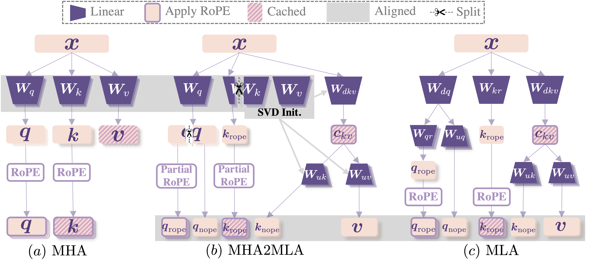

# MHA2MLA

This repo contains the code for the paper ["Towards Economical Inference: Enabling DeepSeek's Multi-Head Latent Attention in Any Transformer-based LLMs"](https://arxiv.org/abs/2502.14837).



## News

- [2025.03.09] Released the first version of inference code which implemtded using PyTorch, will try to integrate FlashMLA to update the inference code.
- [2025.03.04] The four [MLA checkpoints](https://huggingface.co/collections/fnlp/mha2mla-67c51287dfc6cd46127e1b92) ($d_{kv}$=8/16/32/128) derived from `SmolLM-135M/360M/1B7` are publicly available.
- [2025.03.03] The four [MLA checkpoints](https://huggingface.co/collections/fnlp/mha2mla-67c51287dfc6cd46127e1b92) ($d_{kv}$=16/32/64/256) derived from `Llama-2-7B` are publicly available.
- [2025.02.21] The paper of MHA2MLA is publicly available: https://arxiv.org/abs/2502.14837
- [2025.02.19] Released the first version of the MHA2MLA code, providing usage code for Llama fine-tuning and evaluating.

## TO-DO

- [ ] ~~Provide the code for incorporating the projection matrix and inference.~~
- [ ] Thanks to DeepSeek for open-sourcing the [FlashMLA](https://github.com/deepseek-ai/FlashMLA) inference framework. It’s theoretically possible to save more GPU memory usage using this framework. Let’s see how economical MHA2MLA + FlashMLA (+ KV quanto) can be!
- [x] Release the code of MHA2MLA based on HuggingFace `Transformers`

## Models

- SmolLM: https://huggingface.co/blog/smollm
- Llama-2-7b-hf: https://huggingface.co/meta-llama/Llama-2-7b-hf

## Datasets

First download the datasets.

- smollm-corpus(fineweb-edu-dedup, cosmopedia-v2, python-edu): https://huggingface.co/datasets/HuggingFaceTB/smollm-corpus
- open-web-math: https://huggingface.co/datasets/open-web-math/open-web-math
- stackoverflow: https://huggingface.co/datasets/bigcode/stackoverflow-clean

Secondly, process the datasets according to https://github.com/huggingface/nanotron/blob/main/docs/nanoset.md.

## Environment

Install pytorch and other packages.

```sh
conda create -n mla-ft python=3.11
pip install torch==2.4.0 torchvision==0.19.0
pip install -r requirements.txt
```

## MHA2MLA Fine-Tuning

First, prepare three configuration files:
1. A general configuration file referencing [135M_4GPU.yaml](./configs_hf/rope/135M_4GPU.yaml)
2. A partial-RoPE configuration file referencing [rope_v4_topk4.yaml](./configs_hf/rope/rope_v4_topk4.yaml)
3. A SVD configuration file referencing [svd_method7_rank8.yaml](./configs_hf/rope/svd_method7_rank8.yaml)

The available strategies for each method are listed below:

| Partial-RoPE version | Strategy                       |
| :------------------: | ------------------------------ |
|          0           | full-RoPE                      |
|          1           | $\mathcal{S}_{\text{high}}$    |
|          2           | $\mathcal{S}_{\text{uniform}}$ |
|          4           | $\mathcal{S}_{\text{2-norm}}$  |
|          5           | $\mathcal{S}_{\text{low}}$   |

| SVD version | Strategy          |
| :---------: | ---------------- |
|      2      | $SVD_{split}$ |
|      7      | $SVD_{joint}$ |

> The research presented in our paper was conducted using [nanotron](https://github.com/huggingface/nanotron) framework. Since there are differences between `transformers` and `nanotron`, hyperparameter search might be necessary. For exact reproduction of the paper's results, we recommend using [nanotron](https://github.com/huggingface/nanotron) for fine tuneing which refer to [README for nanotron](./src/mha2mla_nt/README.md).

Then, use the following command for MLA fine-tuning:
```sh
torchrun --nproc_per_node 4 \
    ../src/mha2mla/run_train.py \
    --config_file ../configs_hf/rope/135M_4GPU.yaml \
    --partial_rope_config ../configs_hf/rope/rope_v4_topk4.yaml \
    --svd_config ../configs_hf/rope/svd_method7_rank8.yaml
```


> If you want to use the partial-RoPE version 4, you should get the `qk_tensor` first.
> Using the following command, you can get the `qk_tensor`:
>
> ```sh
> torchrun --nproc_per_node 1 \
>     ../src/mha2mla/2_norm.py \
>     --config_file ../configs_hf/rope/135M_4GPU.yaml \
>     --output_dir ./qk_tensor_hf_test.pth \
>     --sample_size 1024
> ```

## Lighteval Evaluation

For the MLA evaluation, you can use the following command:

```sh
accelerate launch --multi_gpu --num_processes=4 \
    ../src/mha2mla/eval.py --partial_rope_config ${cfg_RoPE} --is_mla \
    accelerate \
    --model_args "pretrained=${model_name_or_path},revision=main,dtype=bfloat16,max_length=2048" \
    --override_batch_size 48 \
    --custom_tasks "../src/mha2mla/tasks.py" \
    --tasks "../src/mha2mla/smollm1_base.txt" \
    --output_dir "../eval_results/"
```

## LongBench Evaluation

For the baseline evaluation, you can use the following command:

```sh
torchrun --nproc_per_node=4 \
    ../src/mha2mla/longbench.py \
    --model_path ${model_name_or_path} \
    --tokenizer_path ${model_name_or_path} \
    --longbench True \
    --lb_max_tokens 2048 \
    --lb_batch_size 16 \
    --output_dir /longbench/bf16 \
    --dtype "bfloat16"
```

For the MLA model, you should add the parameter `--is_mla` to the command.

If you want to use the quantized KV cache, you can use the following command:

```sh
torchrun --nproc_per_node=4 \
    ../src/mha2mla/longbench.py \
    --model_path ${model_name_or_path} \
    --tokenizer_path ${model_name_or_path} \
    --longbench True \
    --lb_max_tokens 2048 \
    --lb_batch_size 16 \
    --output_dir /longbench/${model_name_or_path}_hqq_int4 \
    --dtype "bfloat16" \
    --cache_implementation "quantized" \
    --backend "HQQ" \
    --nbits 4 \
    --residual_length 128 \
```

## Inference

Once prepareded local model checkpoint and [monkey patch file](../src/mha2mla/monkey_patch.py), you can perform model inference using the code provided below.

```python
import json,os
import torch
from transformers import LlamaForCausalLM,AutoTokenizer

model_path = "" # local path

# Monkey Patch
from monkey_patch import infer_monkey_patch
with open(os.path.join(model_path,"config.json"),"r") as f:
    model_config = json.load(f)
infer_monkey_patch(model_config["RoPE"])

tokenizer = AutoTokenizer.from_pretrained(model_path)
model = LlamaForCausalLM.from_pretrained(model_path, torch_dtype=torch.bfloat16).cuda()

# Generate
text = "Please give a brief introduction to the structure of the Transformer."
inputs = tokenizer(text, return_tensors="pt")
inputs = {k: v.to(model.device) for k, v in inputs.items()}
generation_kwargs = {"do_sample": False ,"use_cache":True,"max_new_tokens": 128}
output = model.generate(**inputs, **generation_kwargs)
print(tokenizer.batch_decode(output))
```

## Citation
```
@misc{ji2025economicalinferenceenablingdeepseeks,
      title={Towards Economical Inference: Enabling DeepSeek's Multi-Head Latent Attention in Any Transformer-based LLMs}, 
      author={Tao Ji and Bin Guo and Yuanbin Wu and Qipeng Guo and Lixing Shen and Zhan Chen and Xipeng Qiu and Qi Zhang and Tao Gui},
      year={2025},
      eprint={2502.14837},
      archivePrefix={arXiv},
      primaryClass={cs.CL},
      url={https://arxiv.org/abs/2502.14837}, 
}
```
